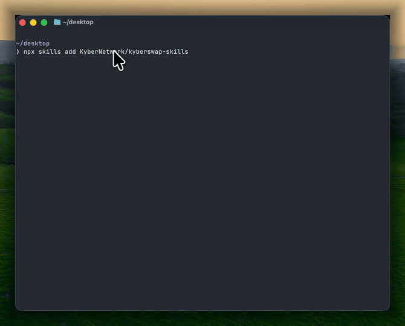
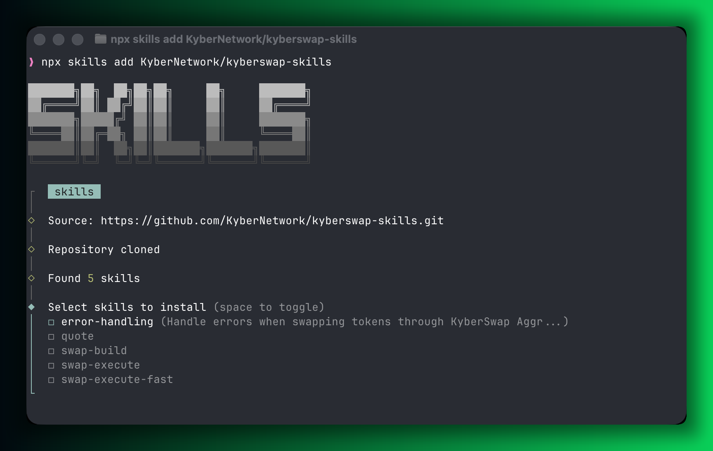

# KyberSwap Skills

Skills for interacting with [KyberSwap](https://docs.kyberswap.com) DeFi infrastructure. Get swap quotes, build transaction calldata, create limit orders, and zap into liquidity pools across EVM chains.

<p align="center">
  
  <br />
  <em>Install the plugin and get a swap quote in seconds</em>
</p>

<p align="center">
  
  <br />
  <em>Get a real-time swap quote across 18 EVM chains</em>
</p>

## Structure

This is a Claude Code plugin. Skills live in the `skills/` directory; shared API docs and token data live in `references/`.

```
kyberswap-skills/
├── .claude-plugin/
│   └── plugin.json     # Plugin manifest
├── skills/
│   ├── quote/          # Get a swap quote
│   │   └── SKILL.md
│   ├── swap-build/     # Build swap calldata (with confirmation)
│   │   └── SKILL.md
│   ├── swap-execute/   # Execute swap via Foundry cast (with confirmation)
│   │   └── SKILL.md
│   ├── swap-execute-fast/  # Build + execute in one step (no confirmation)
│   │   ├── SKILL.md
│   │   └── scripts/
│   │       ├── fast-swap.sh      # Token resolution + route building
│   │       └── execute-swap.sh   # Calls fast-swap.sh then broadcasts
│   ├── limit-order/    # Create, query, cancel gasless limit orders
│   │   └── SKILL.md
│   ├── limit-order-fast/  # Create limit order in one step (no confirmation)
│   │   ├── SKILL.md
│   │   └── scripts/
│   │       └── fast-limit-order.sh  # Token resolution + sign + create
│   ├── order-manager/  # View and analyze limit orders across all statuses
│   │   └── SKILL.md
│   ├── token-info/     # Token metadata, price, and safety lookup
│   │   └── SKILL.md
│   ├── zap/            # Zap in/out of concentrated liquidity pools
│   │   └── SKILL.md
│   ├── zap-fast/       # Build + execute zap in one step (no confirmation)
│   │   ├── SKILL.md
│   │   └── scripts/
│   │       ├── fast-zap.sh      # Token resolution + zap route building
│   │       └── execute-zap.sh   # Calls fast-zap.sh then broadcasts
│   ├── position-manager/ # View and analyze liquidity positions
│   │   └── SKILL.md
│   └── error-handling/ # Error diagnosis and resolution
│       └── SKILL.md
├── references/         # Shared docs
│   ├── api-reference.md
│   └── token-registry.md
├── tests/              # Test suite
│   ├── test-fast-swap.sh
│   └── agent-test-cases.md
└── README.md
```

## Skills

### quote

Get the best swap route and price for a token pair.

```
/quote 1 ETH to USDC on ethereum
/quote 100 USDC to WBTC on arbitrum
/quote 0.5 WBTC to DAI on polygon
```

Returns: expected output amount, USD values, exchange rate, gas estimate, and the route path (which DEXes are used).

### swap-build

Build a full swap transaction (get route + encoded calldata). Requires a sender address. Shows quote details (exchange rate, minimum output, gas) and asks for confirmation before building.

```
/swap-build 100 USDC to ETH on arbitrum from 0xYourAddress
/swap-build 1 ETH to USDC on ethereum from 0xYourAddress slippage 100
```

Returns: encoded calldata, router address, transaction value, gas estimate, and minimum output after slippage. Does **not** submit the transaction on-chain.

### swap-execute

Execute a previously built swap transaction on-chain using Foundry's `cast send`. Takes the output from `swap-build` and broadcasts it.

```
/swap-execute
```

Requires Foundry (`cast`) installed. Supports multiple wallet methods: environment variable, Ledger, Trezor, or keystore. Shows confirmation before executing (transactions are irreversible).

### swap-execute-fast

Build AND execute a swap in one step — no confirmation prompts.

```
/swap-execute-fast 1 ETH to USDC on base from 0xYourAddress
/swap-execute-fast 100 USDC to ETH on arbitrum from 0xYourAddress keystore mykey
/swap-execute-fast 0.5 WBTC to DAI on polygon from 0xYourAddress ledger
```

Requires `cast`, `curl`, and `jq`. **EXTREMELY DANGEROUS**: Builds and executes immediately without any confirmation. Only use when you fully trust the parameters and understand the risks.

### limit-order

Create, query, and cancel gasless limit orders. Orders are signed off-chain (EIP-712) and settled on-chain when filled. Supports gasless cancellation (free, up to 90s) and hard cancellation (on-chain, immediate).

```
/limit-order limit sell 1000 USDC for ETH at 0.00035 on arbitrum from 0xYourAddress
/limit-order check my limit orders on ethereum for 0xYourAddress
/limit-order cancel limit order {orderId} on arbitrum from 0xYourAddress
```

Returns: order ID, target price, expiry, fee structure, and ERC-20 approval reminder. Supports 17 chains (no MegaETH). Contract: DSLOProtocol `0xcab2FA2eeab7065B45CBcF6E3936dDE2506b4f6C`.

### limit-order-fast

Sign and create a limit order in one step — no confirmation prompts.

```
/limit-order-fast sell 1000 USDC for ETH at 0.00035 on arbitrum from 0xYourAddress
/limit-order-fast sell 0.5 ETH to USDC at 3200 on ethereum from 0xYourAddress keystore mykey
```

Requires `cast`, `curl`, `jq`, and `bc`. **EXTREMELY DANGEROUS**: Signs the EIP-712 message and creates the order immediately without any review. Signing authorizes the limit order contract to spend your tokens.

### order-manager

View and analyze limit orders across all statuses (open, partially filled, filled, cancelled, expired). Shows fill progress, transaction history, and portfolio summary.

```
/order-manager show my orders on ethereum for 0xYourAddress
/order-manager show filled orders on arbitrum for 0xYourAddress
/order-manager order summary for 0xYourAddress
```

Returns: order tables with fill percentage, target/effective price, remaining amounts, fill history with transaction hashes, and actionable suggestions.

### token-info

Look up token metadata (address, decimals, market cap) and live USD price. Useful as reference before placing limit orders or zapping into pools.

```
/token-info price of ETH on ethereum
/token-info WBTC on arbitrum
/token-info check price of LINK, UNI, AAVE on ethereum
```

Returns: token address, decimals, live USD price (via Aggregator quote), market cap, CMC rank, safety status (honeypot/FOT check), and verification status.

### position-manager

View and analyze DeFi liquidity positions across chains. Shows in-range/out-of-range status, APR, unclaimed fees, earnings, and portfolio summary.

```
/position-manager show my positions for 0xYourAddress
/position-manager check positions on ethereum for 0xYourAddress
/position-manager show closed positions on arbitrum for 0xYourAddress
```

Returns: portfolio summary (total value, unclaimed fees, earned fees), position tables with APR, price ranges, current amounts, and actionable suggestions for out-of-range positions.

### zap

Zap into or out of concentrated liquidity positions in one transaction. Handles token ratio calculation, swaps, and deposits automatically via KyberSwap Zap as a Service (ZaaS).

```
/zap 1 ETH into the USDC/ETH pool on arbitrum from 0xYourAddress
/zap out position #12345 on arbitrum from 0xYourAddress
```

Returns: zap route details, pool info, position range, protocol fee, gas estimate, and encoded calldata. Supports 13 chains. Contract: KSZapRouterPosition `0x0e97c887b61ccd952a53578b04763e7134429e05`.

### zap-fast

Build AND execute a zap in one step — no confirmation prompts.

```
/zap-fast ETH 1 0xPoolAddress uniswapv3 -887220 887220 on arbitrum from 0xYourAddress
/zap-fast USDC 100 0xPoolAddress pancakeswapv3 -100 100 on base from 0xYourAddress keystore mykey
```

Requires `cast`, `curl`, and `jq`. **EXTREMELY DANGEROUS**: Builds the zap route and broadcasts the transaction immediately without any confirmation. Carries impermanent loss risk. Only use when you fully trust the parameters.

## Installation

Install as a Claude Code plugin:

```bash
# From the Claude Code CLI
/install-plugin https://github.com/kyberswap/kyberswap-skills

# Or test locally
claude --plugin-dir /path/to/kyberswap-skills
```

<p align="center">
  
  <br />
  <em>Skills as they appear in Claude Code after installation</em>
</p>

## Supported Chains

Ethereum, BNB Smart Chain, Arbitrum, Polygon, Optimism, Base, Avalanche, Linea, Mantle, Sonic, Berachain, Ronin, Unichain, HyperEVM, Plasma, Etherlink, Monad, MegaETH.

## How It Works

```
Swap (safe path):
  /quote ──► /swap-build ──► /swap-execute ──► on-chain tx
                (confirm)       (confirm)

Swap (fast path — dangerous):
  /swap-execute-fast ──► on-chain tx (no confirmation)

Limit orders (safe path):
  /limit-order create ──► EIP-712 sign ──► order live (gasless)
                (confirm)
  /limit-order cancel ──► gasless (free) or hard cancel (on-chain)

Limit orders (fast path — dangerous):
  /limit-order-fast ──► EIP-712 sign ──► order live (no confirmation)

Liquidity (safe path):
  /zap in  ──► route ──► build tx (confirm) ──► on-chain tx
  /zap out ──► route ──► build tx (confirm) ──► on-chain tx

Liquidity (fast path — dangerous):
  /zap-fast ──► on-chain tx (no confirmation)

Portfolio & info (read-only):
  /token-info      ──► metadata + live price + safety check
  /order-manager   ──► order list + fill history + analytics
  /position-manager ──► position list + APR + unclaimed fees
```

1. **Claude Code plugin** — Installed as a plugin with auto-discovered skills in the `skills/` directory.
2. **Markdown-driven skills** — `quote`, `swap-build`, `swap-execute`, `limit-order`, and `zap` are pure markdown instructions. The agent reads them and executes the workflow directly.
3. **Script-driven skills** — `swap-execute-fast`, `limit-order-fast`, and `zap-fast` use shell scripts (`curl` + `jq` + `cast`) to build and execute in one step.
4. **Token resolution** — Native tokens and major stablecoins are in `references/token-registry.md`. For all other tokens, the agent (or script) queries the KyberSwap Token API (`token-api.kyberswap.com`).
5. **Safety by design** — `swap-build`, `limit-order`, and `zap` require confirmation before building/signing. `swap-execute` requires confirmation before broadcasting. Only the `-fast` variants (`swap-execute-fast`, `limit-order-fast`, `zap-fast`) run without confirmation (for automation use cases).

## Testing

```bash
# Automated tests for fast-swap.sh (unit + live API calls)
bash tests/test-fast-swap.sh

# Unit tests only (offline)
bash tests/test-fast-swap.sh unit
```

See `tests/agent-test-cases.md` for manual test prompts to validate AI agent behavior across all four skills.

## Contributing

1. Fork and create a feature branch
2. Add or update skills with a `SKILL.md`
3. Optionally add reference docs in `references/`
4. Run `bash tests/test-fast-swap.sh` to verify
5. Open a pull request
